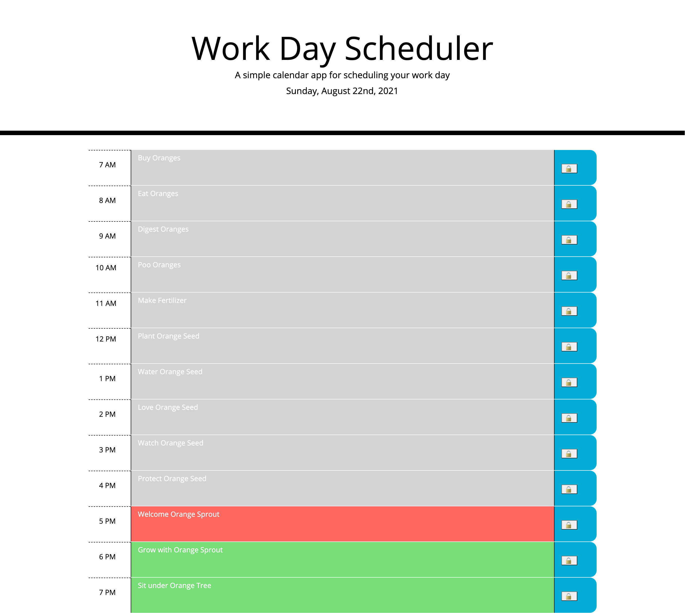

# dynamically-updated-day-planner

## A Day Planner which responds to the current time &amp; day, saving user input on page reload

In a time when we are stretching ourselves thin, engaged in all sorts of activities & endeavors, having somewhere to place our business is imperative to calming our minds. Sometimes it can feel like we're going crazy trying to remember all of the to-do's, events & deadlines. This calendar was created so users no longer have to keep this chaos jumbled in their head. Users can update their calendar as the day progresses & the saved events will be there even after page reload so it is always accessible.

This was a nice project that allowed me to become familiar with moment.js & how to change styles based on the current time of day. I was also able to strengthen my experience with local storage & text area inputs.

In order to access the deployed application, please click here : https://lyndseyjw.github.io/dynamically-updated-day-planner/

I hope you enjoy!

